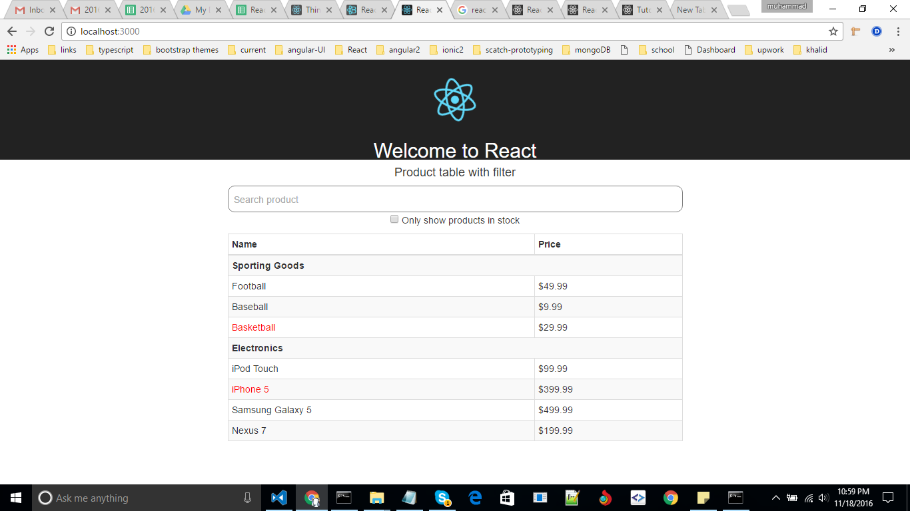

Introduction:

This example based on products list with categories where user can filter the record by product name.

This project was bootstrapped with [Create React App](https://github.com/facebookincubator/create-react-app).

# Getting start:

```
npm install -g create-react-app
create-react-app repo-name
cd repo-name
npm start
```

Runs the app in the development mode.<br>
Open [http://localhost:3000](http://localhost:3000) to view it in the browser.

>