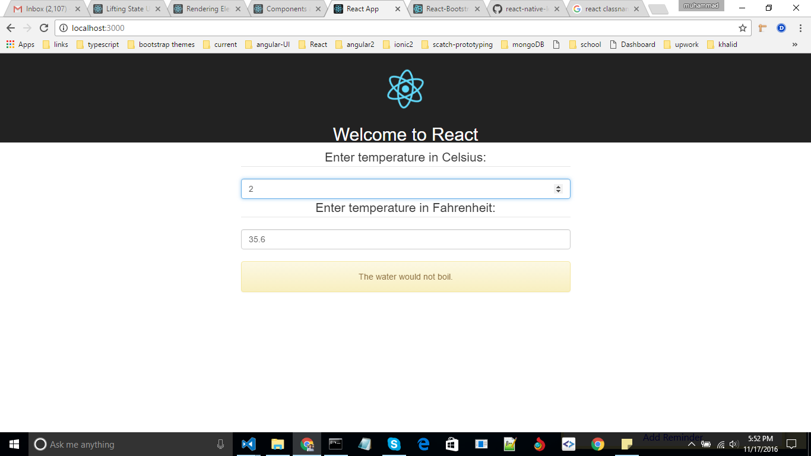
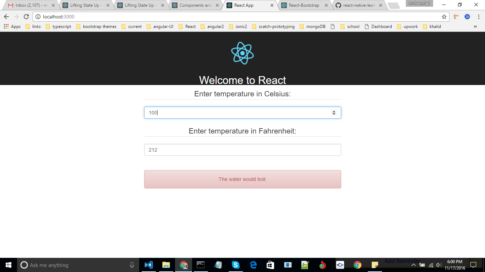
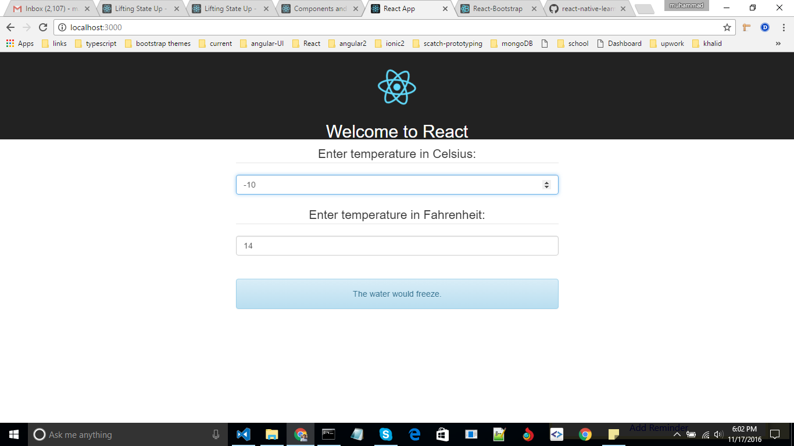

Introduction:

This example based on temperature calculation of Celsius into Fahrenheit. If celsius value would be 100 the water would boil state otherwise it cann't boil. if value would be (-)ve then it would be freeze state.

This project was bootstrapped with [Create React App](https://github.com/facebookincubator/create-react-app).

# Getting start:

```
npm install -g create-react-app
create-react-app repo-name
cd repo-name
npm start
```

Runs the app in the development mode.<br>
Open [http://localhost:3000](http://localhost:3000) to view it in the browser.

>
>
>